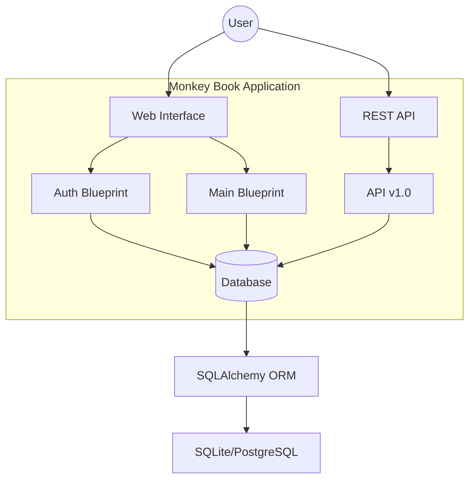
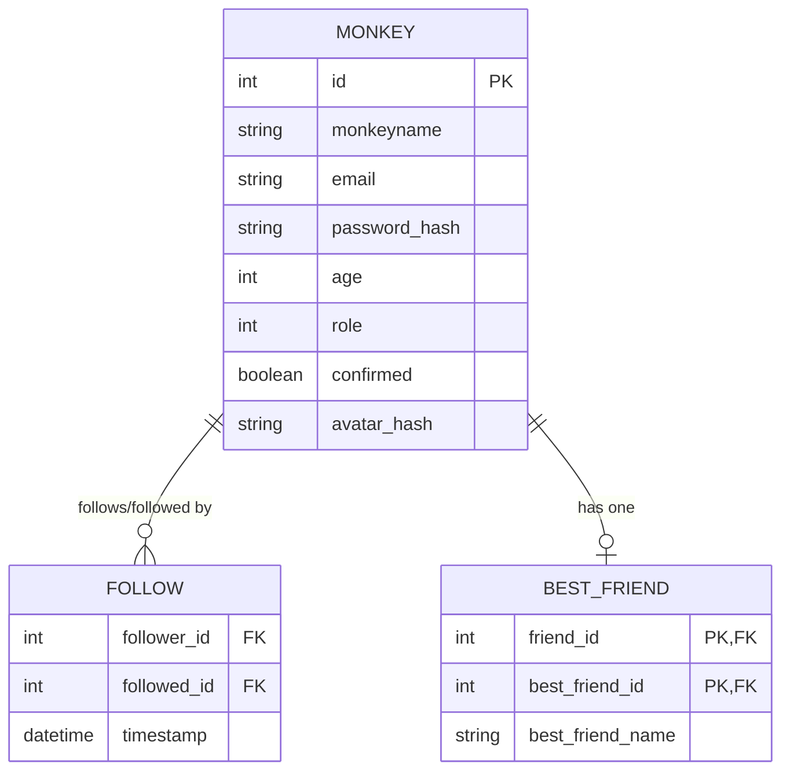

# 🐒 Monkey Book

[](http://flask.pocoo.org/)
[](https://opensource.org/licenses/MIT)

A mini social network designed specifically for monkeys. Connect with friends, share your profile, and find your Best Monkey Friend (BMF).

> **Note:** This project was originally hosted on Heroku, but it has been updated for local development and general deployment.

---

## 📋 Table of Contents

- [Overview](#-overview)
- [Features](#-features)
- [System Architecture](#-system-architecture)
- [Database Schema](#-database-schema)
- [Tech Stack](#-tech-stack)
- [Installation & Setup](#-installation--setup)
- [Usage](#-usage)
- [API Reference](#-api-reference)
- [Testing](#-testing)

---

## 🌟 Overview

**Monkey Book** is a social platform where monkeys can create profiles, follow each other, and designate one "Best Friend". It features a full authentication system, profile management, and a RESTful API.

### Key Capabilities:
- **Profile Management**: Create, edit, and view monkey profiles.
- **Social Graph**: Follow/unfollow other monkeys.
- **Best Friend System**: Every monkey can have exactly one "Best Friend" at a time.
- **Admin Controls**: Administrators can manage and remove monkey profiles.
- **Search & Sort**: List and sort monkeys by name, friend count, or best friend name.

---

## 🏗 System Architecture

The application follows a standard Flask blueprint architecture for modularity.



---

## 📊 Database Schema

The core logic revolves around the `Monkey`, `Follow`, and `BestFriend` models.



---

## 💻 Tech Stack

- **Backend**: Python, [Flask](http://flask.pocoo.org/)
- **Database**: [SQLAlchemy](https://www.sqlalchemy.org/) (ORM), [Flask-Migrate](https://flask-migrate.readthedocs.io/)
- **Frontend**: [Flask-Bootstrap](https://pythonhosted.org/Flask-Bootstrap/), [AngularJS](https://angularjs.org/) (minimal)
- **Authentication**: [Flask-Login](https://flask-login.readthedocs.io/), [Flask-HTTPAuth](https://flask-httpauth.readthedocs.io/)
- **Testing**: [Pytest](https://docs.pytest.org/), Unittest

---

## 🚀 Installation & Setup

### Prerequisites
- Python 2.7 or 3.x
- `virtualenv`

### Steps

1. **Clone the repository**:
   ```bash
   git clone https://github.com/your-repo/monkey-book.git
   cd monkey-book
   ```

2. **Create a virtual environment**:
   ```bash
   virtualenv venv
   source venv/bin/activate  # On Windows: venv\Scripts\activate
   ```

3. **Install dependencies**:
   ```bash
   pip install -r requirements.txt
   ```

4. **Set up Environment Variables**:
   Create a `.env` file or export variables:
   ```bash
   export FLASK_APP=manage.py
   export FLASK_CONFIG=default
   export MAIL_USERNAME=<your-email>
   export MAIL_PASSWORD=<your-password>
   ```

5. **Initialize Database**:
   ```bash
   python manage.py db upgrade
   ```

6. **Run the application**:
   ```bash
   python manage.py runserver
   ```

---

## 📖 Usage

### Running Fake Data
To populate the database with dummy monkeys for testing:
```bash
python manage.py shell
>>> Monkey.generate_fake(100)
>>> Follow.generate_fake(200)
>>> BestFriend.generate_fake(50)
```

---

## 🔌 API Reference

Monkey Book provides a basic REST API for integration.

| Endpoint | Method | Description |
| :--- | :--- | :--- |
| `/api/v1.0/monkeys/<id>` | `GET` | Get monkey profile details in JSON. |
| `/api/v1.0/monkeys/<id>/friends/` | `GET` | List friends for a specific monkey. |

**Example Response (`GET /api/v1.0/monkeys/1`):**
```json
{
  "url": "http://localhost:5000/api/v1.0/monkeys/1",
  "monkeyname": "Kong"
}
```

---

## 🧪 Testing

The project uses `pytest` and `unittest` for verification.

**Run all tests:**
```bash
pytest
```

**Run specific tests:**
```bash
python -m unittest tests/other_test_user_model_unittest.py
```
